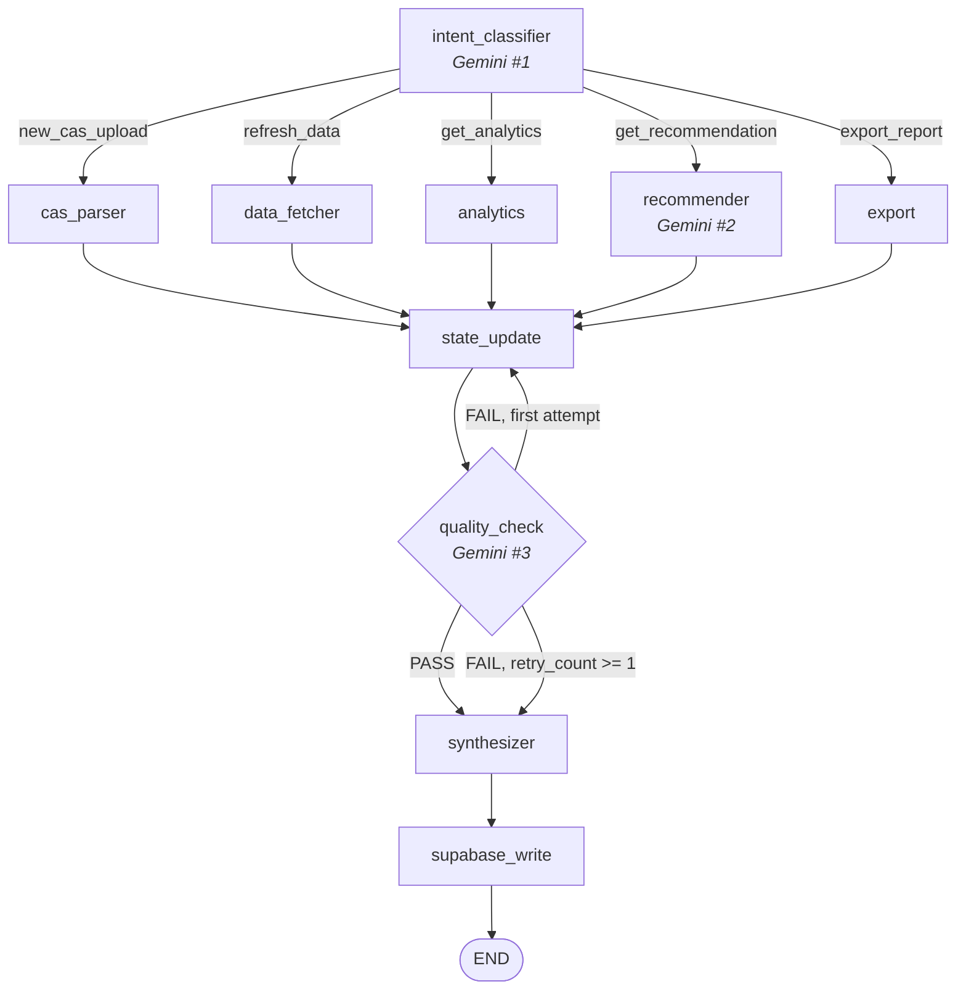

# WealthLens

A personal investment portfolio tracker for Indian mutual fund investors. It ingests
NSDL / CAMS / KFintech **CAS** (Consolidated Account Statement) PDFs and turns them into
institutional-grade analytics, AI-written commentary, and downloadable reports.

```
CAS PDF  →  parse holdings + full transaction history
         →  fetch daily NAVs (MFApi / AMFI) + Nifty 50 benchmark
         →  compute XIRR, trailing & rolling returns, Alpha, Beta, Sharpe, Sortino, Treynor, Max Drawdown
         →  analyse with a LangGraph multi-agent workflow powered by Gemini
         →  export Excel / Word / PowerPoint reports
```

Everything is per-user and protected by Supabase Auth + Row Level Security.

---

## Contents

- [Features](#features)
- [Architecture](#architecture)
- [Tech stack](#tech-stack)
- [Repository layout](#repository-layout)
- [Getting started](#getting-started)
  - [Prerequisites](#prerequisites)
  - [1. Supabase setup](#1-supabase-setup)
  - [2. Backend](#2-backend)
  - [3. Frontend](#3-frontend)
  - [4. First run](#4-first-run)
- [Configuration reference](#configuration-reference)
- [API reference](#api-reference)
- [How it works](#how-it-works)
  - [CAS ingestion](#cas-ingestion)
  - [NAV & benchmark pipeline](#nav--benchmark-pipeline)
  - [Analytics engine](#analytics-engine)
  - [LangGraph agent](#langgraph-agent)
  - [Report export](#report-export)
- [Security model](#security-model)
- [Testing](#testing)
- [Troubleshooting](#troubleshooting)
- [Known gaps & roadmap](#known-gaps--roadmap)

---

## Features

**Portfolio dashboard** (`/dashboard`)
- Summary cards: current value, invested, total gain, return %, portfolio XIRR
- Allocation pie chart across schemes
- Fund cards with a 12-month NAV sparkline each
- Drag-and-drop CAS upload with password entry, progress, and parse summary
- **Refresh prices** — triggers the same NAV sync the nightly scheduler runs

**Fund detail** (`/fund/[isin]`)
- Value / invested / gain / XIRR cards
- Risk & return grid: Alpha, Beta, Sharpe, Sortino, Treynor, Max Drawdown, Expense Ratio, Turnover Ratio — each with a plain-language tooltip
- Invested-vs-value chart with 1M / 3M / 6M / 1Y / 3Y / Max ranges, reconstructed from the transaction ledger
- Trailing-returns table for every fund, with the current fund highlighted

**Compare** (`/compare`)
- Multi-select funds from the portfolio (first three preselected)
- Risk radar chart overlaying the selected funds
- Side-by-side metrics table, colour-matched to the radar

**AI assistant** (`/assistant`)
- Chat over the whole portfolio, answered by the LangGraph graph
- One-click Excel / Word / PowerPoint export, delivered via a short-lived signed URL

**Cross-cutting**
- Dark theme by default with a light theme toggle (persisted in `localStorage`, applied before first paint)
- Monospace tabular numerals everywhere numbers appear
- Indian number formatting (`₹12,34,567.89`, `₹12.34L`, `₹2.50Cr`)
- Skeleton loading states, actionable empty states, global error boundaries

---

## Architecture

```
┌────────────────────────────────────────────────────────────────┐
│                      FRONTEND — Next.js 16                      │
│  /login /signup /dashboard /fund/[isin] /compare /assistant     │
│  Server Components verify the session, Client Components fetch  │
│  through lib/api.ts (attaches the Supabase JWT to every call)   │
└───────────────────────────┬────────────────────────────────────┘
                            │ REST + Bearer JWT
┌───────────────────────────▼────────────────────────────────────┐
│                  BACKEND — FastAPI + LangGraph                  │
│  /auth  /portfolio  /analytics  /agent  /health                 │
│                                                                 │
│  routers/  → thin HTTP layer, Pydantic request/response models  │
│  services/ → all Supabase I/O, CAS parsing, NAV fetch, exports  │
│  agents/   → LangGraph graph + pure-function nodes              │
│  scheduler/→ APScheduler, daily NAV sync at 23:00 IST           │
└───────────────────────────┬────────────────────────────────────┘
                            │
┌───────────────────────────▼────────────────────────────────────┐
│                          DATA LAYER                             │
│  Supabase Postgres (holdings, transactions, nav_history,        │
│    benchmark_history, fund_metrics, reports, cas_uploads)       │
│  Supabase Auth (email/password)  ·  Supabase Storage            │
│  Google AI Studio (Gemini)  ·  MFApi.in  ·  AMFI                │
└────────────────────────────────────────────────────────────────┘
```

**Layering rule:** route handlers contain no business logic. They call a service; services own
Supabase access and orchestration; `agents/nodes/analytics.py` holds pure, side-effect-free math.

---

## Tech stack

| Layer | Choice | Notes |
|---|---|---|
| Backend framework | FastAPI 0.115 + Uvicorn | async, auto-generated OpenAPI at `/docs` |
| Agent framework | LangGraph 0.2 | stateful graph with conditional routing + retry |
| LLM | Google Gemini via `google-generativeai` | model set by `GEMINI_MODEL` |
| CAS parsing | [`casparser`](https://github.com/codereverser/casparser) 1.1 | handles CAMS / KFintech / NSDL format variants |
| Financial math | pandas · numpy · scipy | `brentq` for XIRR, `linregress` for Alpha/Beta |
| Scheduling | APScheduler 3.10 | `AsyncIOScheduler`, `Asia/Kolkata` |
| Exports | openpyxl · python-docx · python-pptx | .xlsx / .docx / .pptx |
| Frontend | Next.js 16.2 (App Router) · React 19 · TypeScript 5 | Turbopack dev server |
| Styling | Tailwind CSS v4 | CSS custom properties drive both themes |
| Charts | Recharts 3.8 | pie, area, radar, line, sparkline |
| Upload UI | react-dropzone 15 | |
| Data / auth / storage | Supabase (Postgres + Auth + Storage) | RLS on every user-scoped table |
| NAV data | MFApi.in (primary), AMFI `NAVAll.txt` (fallback) | |
| Benchmark | Nifty 50, proxied by a Nifty 50 index fund's NAV from MFApi | see [NAV & benchmark pipeline](#nav--benchmark-pipeline) |

---

## Repository layout

```
backend/
├── main.py                       FastAPI app, CORS, lifespan (starts scheduler)
├── requirements.txt
├── Procfile                      process entry point: uvicorn main:app --host 0.0.0.0 --port $PORT
├── .env.example
├── routers/
│   ├── auth.py                   GET /auth/me
│   ├── portfolio.py              upload, holdings, summary, nav-history, sync-navs, debug-parse
│   ├── analytics.py              per-fund metrics, compare, trailing/rolling returns, series
│   └── agent.py                  POST /agent/run, POST /agent/export
├── agents/
│   ├── graph.py                  graph definition, routing, compiled `portfolio_graph`
│   ├── state.py                  PortfolioState TypedDict
│   └── nodes/
│       ├── intent_classifier.py  Gemini call #1 — prompt → intent enum
│       ├── cas_parser.py         wraps the CAS parser service
│       ├── data_fetcher.py       loads nav/benchmark history into state
│       ├── analytics.py          ALL pure financial math + the analytics node
│       ├── recommender.py        Gemini call #2 — metrics → narrative
│       ├── quality_check.py      Gemini call #3 — PASS/FAIL gate
│       ├── export.py             Excel/Word/PPT builders + the export node
│       ├── synthesizer.py        assembles final_response (with fallback summary)
│       └── supabase_write.py     persists the report row
├── services/
│   ├── supabase_client.py        cached service-role client
│   ├── auth_middleware.py        validates the JWT against Supabase Auth
│   ├── rate_limit.py             in-memory sliding-window limiter
│   ├── cas_parser_service.py     casparser → normalized dataclasses
│   ├── nav_fetcher.py            MFApi / AMFI / benchmark fetchers
│   ├── analytics_service.py      Supabase I/O + metric orchestration + caching
│   ├── export_service.py         report generation, upload, signed URL, cleanup
│   └── gemini_client.py          Gemini wrapper, raises GeminiError
├── scheduler/daily_sync.py       nightly NAV sync + report pruning
├── migrations/                   incremental SQL applied after the base schema
└── tests/                        pytest — analytics unit tests + graph integration tests

frontend/
├── app/
│   ├── layout.tsx                fonts, theme bootstrap script, ThemeToggle
│   ├── page.tsx                  redirects to /dashboard or /login
│   ├── (auth)/login|signup       Supabase email/password auth
│   ├── dashboard/                server auth check + DashboardClient
│   ├── fund/[id]/                per-fund detail (id = ISIN)
│   ├── compare/                  multi-fund risk comparison
│   ├── assistant/                chat + export
│   ├── error.tsx · global-error.tsx · not-found.tsx
│   └── globals.css               theme tokens (dark default, light override)
├── components/
│   ├── charts/                   PortfolioPieChart, PerformanceChart, RollingReturnsChart,
│   │                             RiskRadarChart, TrailingReturnsTable, Sparkline
│   ├── portfolio/                CASUploadDropzone, FundCard
│   ├── assistant/                ChatPanel, ExportButton
│   └── ui/                       InfoTip, ThemeToggle
├── lib/
│   ├── api.ts                    typed fetch helpers + all API interfaces
│   ├── formatters.ts             ₹ / % / units / dates — never inline toFixed()
│   ├── metricInfo.ts             tooltip copy for every metric
│   └── supabase-browser.ts · supabase-server.ts
└── proxy.ts                      route guard (Next 16's middleware equivalent)

CLAUDE.md                         full architecture & implementation spec
```

---

## Getting started

### Prerequisites

- Python 3.11+
- Node.js 20+
- A Supabase project
- A Google AI Studio API key ([aistudio.google.com](https://aistudio.google.com/app/apikey))

### 1. Supabase setup

**a. Create the schema.** In the Supabase **SQL editor**, run the `CREATE TABLE` statements and
RLS policies from [`CLAUDE.md` §5](CLAUDE.md#5-database-schema). Tables created:

| Table | Purpose | Scope |
|---|---|---|
| `profiles` | extends `auth.users` | per user |
| `cas_uploads` | upload log (`pending`/`parsing`/`parsed`/`failed`) | per user |
| `holdings` | one row per fund, unique on `(user_id, isin)` | per user |
| `transactions` | full ledger from the CAS | per user |
| `nav_history` | daily NAVs, unique on `(isin, nav_date)` | **shared** |
| `benchmark_history` | Nifty 50 closes, unique on `(index_name, price_date)` | **shared** |
| `fund_metrics` | computed metrics cache, unique on `(user_id, isin)` | per user |
| `reports` | assistant responses and export log | per user |

Enable RLS with an `auth.uid() = user_id` policy on every per-user table. `nav_history` and
`benchmark_history` are shared reference data — read-only for authenticated users, written only
by the backend's service-role key.

**b. Apply the migrations**, in order, in the same SQL editor:

| File | What it does |
|---|---|
| [`backend/migrations/002_add_metric_columns.sql`](backend/migrations/002_add_metric_columns.sql) | adds `treynor_ratio` and `turnover_ratio` to `fund_metrics` |
| [`backend/migrations/003_transactions_dedup_unique.sql`](backend/migrations/003_transactions_dedup_unique.sql) | de-duplicates `transactions` and adds the unique constraint that makes re-uploading a CAS idempotent (requires Postgres 15+) |

Migration 003 matters: without it, uploading the same statement twice doubles your transaction
rows. The backend degrades gracefully (it de-duplicates at read time and falls back to per-row
inserts), but the constraint is the real fix.

**c. Create two private Storage buckets:**

- `cas-pdfs` — uploaded statements, deleted immediately after parsing
- `reports` — generated Excel/Word/PPT files, served via 1-hour signed URLs and pruned nightly

The backend uses the service-role key and bypasses Storage RLS, so no Storage policies are needed.
Keep both buckets **private**.

**d. Note your credentials** from Settings → API: Project URL, `anon` key, `service_role` key.

### 2. Backend

```bash
cd backend
python -m venv .venv
.venv\Scripts\activate           # Windows
# source .venv/bin/activate      # macOS/Linux
pip install -r requirements.txt

cp .env.example .env             # then fill in your values
uvicorn main:app --reload        # http://localhost:8000
```

Interactive API docs: <http://localhost:8000/docs>.
Health checks: `GET /health` (liveness) and `GET /health/deep` (verifies Supabase + Gemini).

### 3. Frontend

```bash
cd frontend
npm install
cp .env.example .env.local       # then fill in your values
npm run dev                      # http://localhost:3000
```

Other scripts: `npm run build`, `npm run start`, `npm run lint`.

### 4. First run

1. **Sign up / log in** at <http://localhost:3000>.
2. **Upload a CAS PDF.** The password is the one that opens the file:
   - NSDL CAS → your registered **email address**
   - CAMS / KFintech CAS → your **PAN** (uppercase)

   For accurate **XIRR**, upload a **Detailed** CAS spanning *inception to today*
   (camsonline.com → CAS → Detailed). A short periodic statement lacks the transaction
   history XIRR needs, and the dashboard will show `—`.
3. **Click "Refresh prices."** This populates `nav_history` and `benchmark_history`. The first
   run downloads full history for every fund and takes a while; later runs are incremental.
   Nothing but the CAS-reported values will show until this finishes.
4. **Explore** the dashboard, fund detail pages, and the Compare page.
5. **Ask the assistant** something ("How is my portfolio doing?") and export a report.

---

## Configuration reference

### Backend — `backend/.env`

| Key | Required | Default | Notes |
|---|---|---|---|
| `SUPABASE_URL` | ✅ | — | Project URL |
| `SUPABASE_SERVICE_ROLE_KEY` | ✅ | — | Server-only. Bypasses RLS — never expose it to the browser |
| `GOOGLE_AI_STUDIO_API_KEY` | ✅ | — | Gemini key. Without it, LLM nodes degrade to non-AI fallbacks |
| `GEMINI_MODEL` | | `gemini-1.5-pro` | Override when Google retires a model version |
| `FRONTEND_URL` | | — | Added to the CORS allow-list alongside `http://localhost:3000` |
| `RISK_FREE_RATE` | | `0.065` | Annual rate used by Sharpe / Sortino / Treynor |
| `REPORT_RETENTION_DAYS` | | `7` | Age at which the nightly job prunes files from the `reports` bucket |
| `SUPABASE_JWT_SECRET` | | — | Present in `.env.example`; **not currently read** — tokens are validated against the Supabase Auth API instead |
| `ENVIRONMENT` | | — | Present in `.env.example`; not currently read |

### Frontend — `frontend/.env.local`

| Key | Required | Notes |
|---|---|---|
| `NEXT_PUBLIC_SUPABASE_URL` | ✅ | Project URL |
| `NEXT_PUBLIC_SUPABASE_ANON_KEY` | ✅ | anon key — safe for the browser |
| `NEXT_PUBLIC_API_URL` | ✅ | Backend base URL (defaults to `http://localhost:8000` if unset) |

Never commit `.env` or `.env.local`; keep the `.env.example` files current instead.

---

## API reference

Every route except `/health*` requires `Authorization: Bearer <supabase_jwt>`.
Percentages come back as numbers (`12.34` means 12.34%); nulls render as `—` in the UI.

### Health

| Method | Path | Description |
|---|---|---|
| `GET` | `/health` | Liveness — no external calls |
| `GET` | `/health/deep` | Readiness — probes Supabase and Gemini, returns `ok` or `degraded` |

### Auth

| Method | Path | Description |
|---|---|---|
| `GET` | `/auth/me` | `{id, email}` for the current user |

### Portfolio

| Method | Path | Description |
|---|---|---|
| `POST` | `/portfolio/upload` | `multipart/form-data` with `file` (PDF, ≤20 MB) and `password`. Parses, aggregates by ISIN, upserts holdings + transactions, deletes the PDF. Returns `{upload_id, status, funds_found, transactions_found}` |
| `GET` | `/portfolio/holdings` | All holdings, ordered by scheme name |
| `GET` | `/portfolio/summary` | Totals, gain %, portfolio XIRR, and the allocation breakdown |
| `GET` | `/portfolio/nav-history` | `{isin: [{nav_date, nav}]}` for the last 12 months — powers the sparklines |
| `POST` | `/portfolio/sync-navs` | Runs the full NAV sync on demand (what "Refresh prices" calls) |
| `POST` | `/portfolio/debug-parse` | Returns raw text, ISIN hits, and folio lines from the first 5 pages — for diagnosing parser issues |

### Analytics

| Method | Path | Description |
|---|---|---|
| `GET` | `/analytics/trailing-returns` | 1W–5Y table for every fund |
| `GET` | `/analytics/compare?isins=a,b,c` | Full metrics for the selected funds |
| `GET` | `/analytics/{isin}` | Full metrics for one fund (404 if not held) |
| `GET` | `/analytics/{isin}/rolling-returns?window=1m\|3m\|6m\|1y\|3y` | Rolling-return time series, ≤300 points |
| `GET` | `/analytics/{isin}/nav-series?range=1m\|3m\|6m\|1y\|3y\|max` | NAV price series, downsampled to ~300 points |
| `GET` | `/analytics/{isin}/performance?range=…` | `[{date, invested, value}]` reconstructed from the ledger |

### Agent

| Method | Path | Description |
|---|---|---|
| `POST` | `/agent/run` | `{prompt}` → `{response_text, export_url?, report_id}`. Runs the full graph. **10 requests/hour per user** |
| `POST` | `/agent/export` | `{format: "excel"\|"word"\|"ppt"}` → `{export_url, filename, format}`. Signed URL valid 1 hour. **10 requests/hour per user** |

> The `WS /agent/stream` endpoint described in `CLAUDE.md` is not implemented; the assistant uses
> the synchronous `POST /agent/run`.

---

## How it works

### CAS ingestion

`services/cas_parser_service.py` is a thin normalisation layer over the `casparser` library —
which already handles the many CAMS / KFintech / NSDL format variants — rather than a homegrown
regex parser. It maps `casparser`'s typed output onto `CASData` / `Holding` / `Transaction`
dataclasses and:

- Trusts the statement's own valuation block (`cost`, `value`, `nav`) as authoritative, since it
  matches the CAS summary page. Falls back to `units × NAV` and summed purchases if absent.
- Maps transaction types to five buckets: `purchase`, `redemption`, `switch_in`, `switch_out`,
  `dividend`. SIP purchases and merger switches fold into their base type.
- Drops tax and bookkeeping rows (STT, stamp duty, TDS, segregation, reversals) — they carry no
  units and aren't investment activity.
- Skips schemes that are fully redeemed with no history.

The upload route then **aggregates across folios**: the same fund held in several folios becomes
one `holdings` row (unique on `user_id, isin`), summing units, cost, and value — matching how the
CAS Portfolio Summary reports totals. Folio numbers are preserved as a comma-joined string.

Transactions are inserted in batches of 500 with `ignore_duplicates`, in-memory de-duplication,
and a per-row fallback if the unique constraint from migration 003 isn't applied yet. Re-uploading
the same statement is safe.

The PDF is deleted from Storage as soon as parsing finishes — success or failure.

### NAV & benchmark pipeline

Runs nightly at **23:00 IST** via APScheduler (started in the FastAPI lifespan), and on demand
from **Refresh prices** / `POST /portfolio/sync-navs`. Both call the same `run_nav_sync()`:

1. Download AMFI's `NAVAll.txt` and build an `ISIN → AMFI code` map.
2. For any ISIN the map misses, search MFApi by scheme name.
3. Backfill missing `amfi_code` values in `holdings`.
4. Per fund, fetch NAV history from MFApi — full history the first time, incremental (only dates
   after the newest row already stored) afterwards. On MFApi failure, fall back to AMFI's text
   file, which yields today's NAV only.
5. Upsert into `nav_history` in batches of 500, ignoring duplicates.
6. Update `current_nav` / `current_value` / `last_updated` on every affected holding.
7. Fetch the benchmark and upsert into `benchmark_history`.
8. Prune report files older than `REPORT_RETENTION_DAYS` from the `reports` bucket.

**About the benchmark:** Yahoo Finance and Stooq both block automated requests, so despite
`yfinance` being installed, the Nifty 50 series is sourced from a Nifty 50 *index fund's* NAV via
MFApi. An index fund tracks the index with well under 0.1% tracking error, and Alpha/Beta are
computed from daily percentage returns rather than absolute levels, so the substitution is
functionally equivalent. Note this is an index-fund NAV, not the Total Return Index the spec
originally called for.

Supabase caps responses at 1000 rows, so every history query pages explicitly — without it,
funds with years of daily NAVs would silently lose their most recent points.

### Analytics engine

Pure math lives in [`backend/agents/nodes/analytics.py`](backend/agents/nodes/analytics.py) and
returns natural units (fractions). `services/analytics_service.py` handles Supabase I/O, converts
to display units, and caches results in `fund_metrics`.

| Metric | Definition | Returned as |
|---|---|---|
| **XIRR** | IRR over actual dated cashflows, solved with `scipy.optimize.brentq` on the NPV function. Purchases/switch-ins negative, redemptions/switch-outs/dividends positive, current value appended as the terminal inflow | percent |
| **Trailing returns** | Point-to-point over 1W/1M/3M/6M/1Y/3Y/5Y windows. **CAGR** for windows over a year, simple return otherwise. `null` when history doesn't cover the window | percent |
| **Rolling returns** | Trailing-window return computed at every date, forming a time series; downsampled to ≤300 points | percent |
| **Alpha / Beta** | OLS regression (`scipy.stats.linregress`) of daily fund returns on daily benchmark returns. Alpha is the intercept annualised ×252. Requires ≥30 overlapping days | alpha percent, beta ratio |
| **Sharpe** | `(mean excess / std excess) × √252`, excess = daily return − `RISK_FREE_RATE`/252 | ratio |
| **Sortino** | Same, but divided by downside deviation only | ratio |
| **Treynor** | `(annualised return − risk-free) / beta` | percent |
| **Max Drawdown** | Largest peak-to-trough fall: `min(nav / cummax(nav) − 1)` | percent (negative) |
| **Expense / Turnover Ratio** | Factsheet figures, not derivable from NAV history — always `null`, shown as `—` | — |

Conventions: 252 trading days for annualisation; risk-free rate defaults to 6.5% p.a.; non-finite
results (NaN/inf) become `null` so JSON stays valid; degenerate inputs (flat series, zero beta,
fewer than 2 points) return `0.0` rather than raising.

Two extra safeguards worth knowing about:

- **Transaction de-duplication at read time.** Rows identical in `(isin, date, type, amount, units)`
  are treated as duplicate imports, not two genuine same-day trades, so invested totals and XIRR
  stay correct even before migration 003 is applied.
- **Opening-position seeding.** When the CAS covers only part of your history, the invested-vs-value
  chart seeds an opening position equal to *current totals minus everything the ledger explains*,
  so the series ends at the true units held and invested value instead of drifting.

### LangGraph agent

State is a single `PortfolioState` TypedDict; every node is `(state) → state` and only
`supabase_write` has side effects. Gemini is called in exactly three nodes.



- **intent_classifier** — classifies the prompt into one of five intents. Unrecognised output or a
  Gemini failure defaults to `get_recommendation`, which is what most chat queries are.
- **recommender** — the graph routes recommendation requests straight here, so it loads metrics
  itself if the analytics node was skipped, then asks Gemini for a 3–5 paragraph advisor narrative.
- **quality_check** — a PASS/FAIL coherence gate. An empty recommendation can't pass. A Gemini
  *infrastructure* failure passes anyway, so QC never blocks delivery of a good answer.
- **synthesizer** — assembles `final_response`; if there's no narrative, it emits a templated
  plain-text portfolio summary built from the metrics alone.
- **supabase_write** — best-effort insert into `reports`; a failure here doesn't fail the request.

The retry loop is capped at one attempt: `quality_check` increments `retry_count` on failure, and
`route_quality_check` sends anything with `retry_count >= 1` straight to the synthesizer. Note that
the retry edge returns to `state_update` (a passthrough), so it re-runs the *check*, not the
generation — a genuinely bad narrative is surfaced as best-effort rather than regenerated. Every
LLM failure path has a non-AI fallback, so the assistant still answers when Gemini is unavailable.

### Report export

`services/export_service.py` gathers metrics and holdings, optionally generates a Gemini narrative,
calls the pure builder in `agents/nodes/export.py`, uploads to the `reports` bucket at
`<user_id>/<uuid>.<ext>`, and returns a **1-hour signed URL**.

| Format | Contents |
|---|---|
| **Excel** (`openpyxl`) | Summary sheet · Holdings sheet · Trailing Returns sheet with an embedded 1-year-return bar chart. Number formats applied per column |
| **Word** (`python-docx`) | Summary table · AI analysis section · Holdings table · Risk metrics table |
| **PowerPoint** (`python-pptx`) | 16:9 dark deck — title, summary cards, one slide per fund, recommendation slide |

Word and PPT include the Gemini narrative; if Gemini fails, a templated paragraph is substituted.
Excel skips the narrative entirely. Every export is logged as a `reports` row.

---

## Security model

- **Every route validates the JWT** (`services/auth_middleware.py`) by calling Supabase's
  `/auth/v1/user` endpoint, which works for both RS256 and HS256 projects. Invalid or expired
  tokens get a 401 with a user-readable message.
- **RLS is the last line of defence.** The backend uses the service-role key and *bypasses* RLS,
  so application-level `user_id` filtering is mandatory on every query — but RLS stays enabled so
  a leaked anon key can't read other users' data.
- **The service-role key never reaches the browser.** The frontend only ever sees the anon key.
- **CAS PDFs are deleted from Storage immediately after parsing**, on both the success and failure
  paths. Only extracted holdings and transactions are retained.
- **Report files expire twice over:** signed URLs last an hour, and the nightly job deletes files
  older than `REPORT_RETENTION_DAYS`.
- **Rate limiting** on `/agent/run` and `/agent/export`: 10 requests per user per hour, in-memory
  sliding window. Single-process only — a multi-worker setup would need a Redis-backed limiter.
- **Uploads are constrained** to `.pdf` at ≤20 MB.
- **No raw tracebacks reach the frontend** — errors are logged server-side and mapped to
  user-readable messages.

---

## Testing

```bash
cd backend
.venv\Scripts\python.exe -m pytest tests/ -q     # Windows
# .venv/bin/python -m pytest tests/ -q           # macOS/Linux
```

24 tests, all passing:

- [`tests/test_analytics.py`](backend/tests/test_analytics.py) — every formula against
  independently derived closed-form expectations (a 10% XIRR over exactly 365 days, β = 2 when the
  fund is 2× the benchmark, −25% max drawdown on a known series), plus the degenerate cases:
  insufficient history, same-sign cashflows, zero volatility, zero beta.
- [`tests/test_agent_graph.py`](backend/tests/test_agent_graph.py) — the full graph end-to-end with
  Gemini and Supabase mocked: the happy path, the Gemini-failure fallback to a metrics summary, and
  intent-classifier defaulting on gibberish.

CAS parser fixtures go in `backend/tests/fixtures/` (empty by default — real statements contain
personal data and shouldn't be committed).

---

## Troubleshooting

| Symptom | Cause & fix |
|---|---|
| **"Incorrect PDF password"** | NSDL CAS uses your registered **email address**; CAMS/KFintech uses your **PAN** in uppercase |
| **XIRR shows `—` or 0** | The statement lacks full transaction history. Upload a **Detailed** CAS covering inception-to-today from camsonline.com. XIRR needs real dated cashflows and is never approximated |
| **All metrics show `—`** | `nav_history` is empty. Click **Refresh prices** and wait — the first sync downloads full history for every fund |
| **Alpha/Beta are 0** | Fewer than 30 overlapping fund/benchmark days, or `benchmark_history` is empty. Check the sync logs for the Nifty 50 fetch |
| **Expense / Turnover always `—`** | Expected. These are factsheet figures with no data source wired up yet |
| **Sparklines look truncated** | Usually the 1000-row Supabase cap; the endpoints page past it, so check that the sync actually populated a year of NAVs |
| **Duplicate transactions after re-upload** | Migration 003 isn't applied. Run it — read-time de-duplication keeps analytics correct meanwhile |
| **Export fails** | The private `reports` bucket doesn't exist. Create it in Supabase Storage |
| **`429 Rate limit reached`** | 10 assistant/export calls per user per hour. The `Retry-After` header says how long to wait |
| **CORS errors from the browser** | The frontend isn't on `http://localhost:3000`. Set `FRONTEND_URL` on the backend to the exact origin you're serving from |
| **Parsing succeeds but finds no funds** | Use `POST /portfolio/debug-parse` to dump the first five pages of extracted text plus ISIN and folio hits |
| **Gemini errors / empty AI responses** | Check `GOOGLE_AI_STUDIO_API_KEY`, and set `GEMINI_MODEL` if Google retired the default. `GET /health/deep` reports `degraded` when Gemini is unreachable. The assistant still answers with non-AI fallbacks |

---


